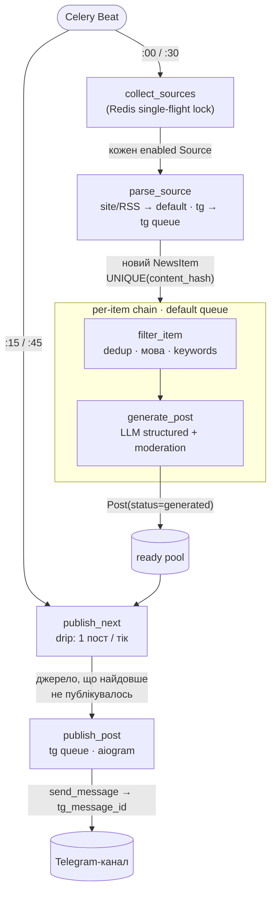

# M4 — AI-генератор постів для Telegram

Сервіс збирає новини з RSS/сайтів та публічних Telegram-каналів, фільтрує й дедуплікує їх, генерує через LLM лаконічний україномовний пост і **крапельно** публікує його у власний канал — усім керує REST API зі Swagger.


---

## Зміст

1. [Що вміє сервіс](#що-вміє-сервіс)
2. [Архітектура](#архітектура)
3. [Швидкий старт (Docker Compose)](#швидкий-старт-docker-compose)
4. [Telegram-сесія (одноразовий крок)](#telegram-сесія-одноразовий-крок)
5. [Локальна розробка (uv)](#локальна-розробка-uv)
6. [Змінні оточення](#змінні-оточення)
7. [API — приклади запитів](#api--приклади-запитів)
8. [Відхилення від ТЗ](#відхилення-від-тз)
9. [Чек-лист функціональності](#чек-лист-функціональності)
10. [Свідомі обмеження](#свідомі-обмеження)
11. [Ліцензія](#ліцензія)

---

## Що вміє сервіс

- 📥 **Збір новин** із RSS/Atom, звичайних сайтів (scrape) та публічних Telegram-каналів (Telethon), кожні 30 хвилин.
- 🧹 **Фільтрація** за мовою (lingua), ключовими словами з лематизацією (pymorphy3) та дедуплікація (exact `content_hash` + Redis seen-set).
- 🤖 **AI-генерація** україномовного поста зі structured outputs (типізована відповідь, а не сирий текст); лінк на джерело та хештеги додає код, не модель.
- 📤 **Крапельна публікація** через бот (aiogram): 1 пост за тік із ротацією джерел, щоб канал не «вистрілював» пачкою й не залипав на одному фіді.
- 🛠 **Керування через REST API** + Swagger (`/docs`): CRUD джерел і ключових слів, історія постів, журнал помилок, ручний запуск генерації.
- 🧱 **Стійкість**: ідемпотентні таски, типізовані ретраї Telegram-помилок, один збійний крок не валить весь батч.

---

## Архітектура



### Процеси (Docker Compose)

| Сервіс | Роль | Конкурентність |
|---|---|---|
| **api** | FastAPI + Uvicorn: REST-запити, ставить таски | — |
| **worker-default** | RSS/site-парсинг, фільтрація, LLM-генерація | 4 |
| **worker-tg** | Telethon (читання) + aiogram (публікація) | **1** (один Telethon-клієнт — інакше `AuthKeyDuplicated`) |
| **beat** | Celery Beat: `collect_sources` (:00/:30) + `publish_next` (:15/:45) | 1 |
| **redis** | Брокер + result backend + seen-set дедуп + Redis-lock | — |
| **db** | PostgreSQL 16 | — |
| **flower** | Дашборд черг (`:5555`) — див. [обмеження](#свідомі-обмеження) | — |
| **migrate** | Одноразовий init: `alembic upgrade head` | — |

`depends_on: condition: service_healthy` гарантує порядок старту: db/redis → migrate → api/workers/beat.

### Пайплайн

Збір і публікація **роз'єднані**. `collect_sources` наповнює пул готових постів; `publish_next` крапельно віддає по одному — це дає рівний темп і різноманіття джерел.

```
beat :00/:30
  └─ collect_sources  (Redis-lock SET NX EX — без перекриття циклів)
       └─ для кожного enabled Source → parse_source
            • site/RSS → default queue        • tg → tg queue (Telethon, min_id-інкремент)
            parse: UPSERT NewsItem UNIQUE(content_hash); дубль = no-op
       └─ для кожного НОВОГО NewsItem:  chain( filter_item | generate_post )
            filter_item   — Redis seen-set дедуп → мова (lingua) → keyword (pymorphy3)
            generate_post — LLM structured + moderation → Post(status=generated)
            ⮑ публікації тут НЕМАЄ: пост лягає в «ready pool»

beat :15/:45  (зсув +15 хв, щоб свіжозгенеровані вже були готові)
  └─ publish_next  — обирає 1 пост від джерела, що найдовше не публікувалось
       └─ publish_post (tg queue) — aiogram send → tg_message_id, status=published
```

Будь-який крок може коректно зупинити ланцюг: не пройшов фільтр → `filter_item` повертає `None`, наступна таска не виконується; помилка генерації/публікації → `Post.status=failed` + запис у `ErrorLog`.

### Ротація джерел при публікації

`publish_next` обирає пост від джерела з **найдавнішою** останньою публікацією (джерела, що ще не публікувались, — першими), а вже всередині джерела — найновіший пост. Так найбагатший за обсягом фід не може домінувати в стрічці, а курований «довгий хвіст» отримує ефір.

### Поділ Telegram: Telethon читає, aiogram пише

- **Telethon** (юзер-сесія, MTProto) — **читання** публічних каналів. Bot API фізично не бачить чужі канали, тож Telethon незамінний.
- **aiogram** (Bot API) — **публікація** у власний канал, де бот є адміном із `can_post_messages`.

Детальне обґрунтування — у розділі [Відхилення від ТЗ](#чому-aiogram-а-не-чистий-telethon).

---

## Швидкий старт (Docker Compose)

```bash
# 1. .env із шаблону
cp .env.example .env

# 2. Заповніть секрети у .env (OPENAI_API_KEY, TELEGRAM_*) — див. «Змінні оточення».
#    TELETHON_STRING_SESSION згенеруємо на наступному кроці.

# 3. Підняти весь стек (migrate сам виконає alembic upgrade head)
docker compose up --build
```

| URL | Що відкриється |
|---|---|
| `http://localhost:8000/docs` | Swagger UI |
| `http://localhost:8000/health` | Health check |
| `http://localhost:5555` | Flower (черги) |

> [!IMPORTANT]
> `docker-compose.yml` встановлює `ENVIRONMENT=prod` → вмикається fail-fast валідація `pydantic-settings`: якщо будь-який обовʼязковий секрет порожній, сервіс не стартує й одразу скаже, якого поля бракує.

> [!TIP]
> Якщо хост уже зайняв порти `5432`/`6379`, є untracked-оверрайд `docker-compose.smoke.yml` (db → `5433`, redis → `6380`):
> `docker compose -f docker-compose.yml -f docker-compose.smoke.yml up --build`.

---

## Telegram-сесія (одноразовий крок)

Telethon потребує юзер-сесії (`StringSession`) для читання публічних каналів:

```bash
# Локально:
uv run python -m scripts.login
# Або через тимчасовий контейнер:
docker compose run --rm api python -m scripts.login
```

Скрипт запитає номер телефону, код підтвердження (і 2FA-пароль, якщо ввімкнений) і виведе `StringSession`. Вставте його у `.env`:

```dotenv
TELETHON_STRING_SESSION=1BVtsOI8Bu...
```

> [!NOTE]
> **Бот-адмін:** бот із `TELEGRAM_BOT_TOKEN` має бути доданий адміністратором каналу `TELEGRAM_CHANNEL_ID` з правом `can_post_messages`.
> **Безпека:** для продакшну краще окремий «розхідний» акаунт-читач. Бот публікує через aiogram, тож юзер-сесія лишається пасивною read-only. `StringSession` ніколи не потрапляє в git.

---

## Локальна розробка (uv)

```bash
uv sync                                   # встановити залежності

uv run pytest -q                          # тести (мережево-чисті: fakeredis, respx, моки) — 206 passing
uv run ruff check                         # лінтер
uv run ruff format                        # форматування
uv run alembic upgrade head               # міграції (за замовч. SQLite)

# Запуск компонентів окремо:
uv run uvicorn app.main:app --host 0.0.0.0 --port 8000
uv run celery -A app.tasks.celery_app worker -Q default -c 4 -l info
uv run celery -A app.tasks.celery_app worker -Q tg -c 1 -l info
uv run celery -A app.tasks.celery_app beat -l info
uv run celery -A app.tasks.celery_app flower --port=5555
```

Для локального запуску без Docker достатньо Redis (`redis-server`); БД — SQLite (`DATABASE_URL=sqlite:///./app.db`, дефолт).

---

## Змінні оточення

Усі змінні читаються з `.env` через `pydantic-settings`. **Обовʼязкові в `prod`** позначені 🔑.

| Змінна | Призначення | Приклад / дефолт |
|---|---|---|
| `ENVIRONMENT` | `local` (SQLite, без перевірки секретів) або `prod` (Postgres, fail-fast) | `local` |
| `DATABASE_URL` | SQLAlchemy DB URL | `sqlite:///./app.db` |
| `REDIS_URL` | Redis: брокер + backend + seen-set + lock | `redis://localhost:6379/0` |
| 🔑 `OPENAI_API_KEY` | Ключ OpenAI або OpenRouter (SecretStr) | `sk-...` / `sk-or-...` |
| `OPENAI_MODEL` | Модель генерації (для OpenRouter — id моделі зі structured outputs) | `gpt-4o-mini` |
| `OPENAI_TIMEOUT` | Таймаут запиту, секунди | `30` |
| `OPENAI_BASE_URL` | OpenAI-сумісний ендпоінт; порожньо = OpenAI. OpenRouter: `https://openrouter.ai/api/v1` | _(порожньо)_ |
| `MODERATION_ENABLED` | Гейт модерації; `false` для OpenRouter (немає `/moderations`) | `true` |
| 🔑 `TELEGRAM_API_ID` | Telethon `api_id` з my.telegram.org (int) | `12345678` |
| 🔑 `TELEGRAM_API_HASH` | Telethon `api_hash` (SecretStr) | `abc123...` |
| 🔑 `TELETHON_STRING_SESSION` | Сесія читача (SecretStr), `scripts/login.py` | `1BVtsOI8...` |
| 🔑 `TELEGRAM_BOT_TOKEN` | Bot API токен від @BotFather (SecretStr) | `123456:ABC...` |
| 🔑 `TELEGRAM_CHANNEL_ID` | ID каналу публікації (int, відʼємне) | `-1001234567890` |
| `ALLOWED_LANGUAGES` | Дозволені мови джерел (вивід завжди українською) | `["uk","en"]` |
| `DEDUP_TTL_SECONDS` | TTL seen-set у Redis | `604800` (7 днів) |
| `KEYWORD_MATCH_MODE` | Семантика keyword-фільтра: `any` (OR) / `all` (AND) | `any` |
| `POST_MAX_LEN` | Жорсткий ліміт довжини поста (символів) | `4096` |
| `MAX_ITEMS_PER_PARSE` | Макс. items на джерело за парсинг (найновіші) — обмежує backfill | `25` |

---

## API — приклади запитів

База: `http://localhost:8000`. Усі списки повертають конверт `{"data": [...], "count": N}`; пагінація — `?limit=` (1–100, дефолт 20) та `?offset=`.

```bash
curl http://localhost:8000/health
# {"status":"ok"}
```

<details>
<summary><b>Sources</b> — CRUD джерел (<code>/api/v1/sources</code>)</summary>

```bash
# Список
curl "http://localhost:8000/api/v1/sources?limit=10&offset=0"

# Створити RSS/сайт (type=site)
curl -X POST http://localhost:8000/api/v1/sources \
  -H "Content-Type: application/json" \
  -d '{"type":"site","name":"DOU","url":"https://dou.ua/rss/all.xml","enabled":true}'
# 201; 409 якщо url уже існує

# Створити Telegram-канал (type=tg)
curl -X POST http://localhost:8000/api/v1/sources \
  -H "Content-Type: application/json" \
  -d '{"type":"tg","name":"TechUA","url":"@techUA","enabled":true}'

# Одне джерело / часткове оновлення / видалення
curl http://localhost:8000/api/v1/sources/{id}                 # 200 | 404
curl -X PATCH http://localhost:8000/api/v1/sources/{id} \
  -H "Content-Type: application/json" -d '{"enabled":false}'   # 200
curl -X DELETE http://localhost:8000/api/v1/sources/{id}       # 204
```

> `type` — `site` або `tg`. Для `site` тип парсера (RSS vs scrape) визначається за URL (`rss`/`feed`/`atom`/`.xml` → RSS, інакше — scrape).
</details>

<details>
<summary><b>Keywords</b> — CRUD ключових слів (<code>/api/v1/keywords</code>)</summary>

```bash
curl "http://localhost:8000/api/v1/keywords?limit=20&offset=0"

curl -X POST http://localhost:8000/api/v1/keywords \
  -H "Content-Type: application/json" \
  -d '{"word":"штучний інтелект","lang":"uk"}'      # 201; 409 якщо існує

curl -X PATCH http://localhost:8000/api/v1/keywords/{id} \
  -H "Content-Type: application/json" -d '{"lang":"en"}'   # 200
curl -X DELETE http://localhost:8000/api/v1/keywords/{id}  # 204
```
</details>

<details>
<summary><b>Posts</b> — історія постів (<code>GET /api/v1/posts</code>)</summary>

```bash
curl "http://localhost:8000/api/v1/posts?limit=10&offset=0"        # усі, найновіші перші
curl "http://localhost:8000/api/v1/posts?status=failed"            # фільтр за статусом
# status ∈ new | generated | published | failed
# елемент: {id, news_id, generated_text, status, published_at, tg_message_id, error, created_at}
```
</details>

<details>
<summary><b>Generate</b> — ручний запуск генерації (<code>POST /api/v1/generate</code>)</summary>

```bash
# За існуючим NewsItem:
curl -X POST http://localhost:8000/api/v1/generate \
  -H "Content-Type: application/json" \
  -d '{"news_id":"550e8400-e29b-41d4-a716-446655440000"}'
# 202 {"task_id":"...","post_id":null}

# Ad-hoc текст (без NewsItem):
curl -X POST http://localhost:8000/api/v1/generate \
  -H "Content-Type: application/json" \
  -d '{"text":"Довільний текст для генерації поста"}'
# 202 {"task_id":"...","post_id":null}
```

> Ендпоінт **ставить таску** (202 Accepted), не чекає завершення. Для ad-hoc тексту створюється синтетичний `NewsItem` (`source="manual"`), далі — **лише генерація** (без авто-публікації). Результат зʼявиться в `GET /api/v1/posts`. Потрібен хоча б один із `news_id` / `text` (інакше 422).
</details>

<details>
<summary><b>Errors</b> — журнал помилок (<code>GET /api/v1/errors</code>)</summary>

```bash
curl "http://localhost:8000/api/v1/errors?limit=10&offset=0"
curl "http://localhost:8000/api/v1/errors?stage=publish"   # stage ∈ parse | generate | publish
# елемент: {id, created_at, stage, source_id, news_id, post_id, message}
```
</details>

---

## Відхилення від ТЗ

Реалізація свідомо відходить від низки приписів навчального ТЗ ([`docs/Project M4-1.md`](docs/Project%20M4-1.md)). Нижче — кожне відхилення з технічним обґрунтуванням.

| ТЗ (M4-1) | Реалізація | Чому |
|---|---|---|
| Публікація **через Telethon** (§5) | **aiogram** (Bot API) для публікації; Telethon — лише читання | ban-safety + правильний інструмент для постингу у власний канал ([деталі](#чому-aiogram-а-не-чистий-telethon)) |
| AI-генерація з **`asyncio`** (чек-ліст #4) | **Повністю синхронний** стек; `asyncio` лише ізольованими островами | Celery prefork = процеси без event loop ([деталі](#чому-синхронний-стек)) |
| **OpenAI GPT-4** через публічний API (§3) | Будь-який **OpenAI-сумісний** провайдер (`OPENAI_MODEL`/`OPENAI_BASE_URL`) + **structured outputs**; дефолт `gpt-4o-mini`, тестовано на OpenRouter | гнучкість провайдера/ціни; типізована відповідь надійніша за вільний текст GPT-4 |
| Простий промпт «емодзі + CTA» (§3) | Розгорнутий україномовний промпт (persona, hook, варіативний CTA, заборонені фрази); **лінк і хештеги додає код**, не модель | стабільніша якість; URL форматує код → модель не галюцинує посилань |
| Брокер **RabbitMQ або Redis** (§2) | **Redis** (broker + backend + dedup + lock) | один datastore замість двох; `SET NX EX` дає атомарність для dedup і lock «безкоштовно» |
| Дедуп за **title/url/контентом** (§4) | exact `content_hash` (sha256 нормалізованих title+url) + Redis seen-set; near-dup/SimHash — future | надійний exact-дедуп зараз; семантичний потребує тюнінгу порогу на реальних даних |
| **Пласка** структура (`app/tasks.py`, `app/models.py`, `app/api/endpoints.py`) | **Шарувата пакетна** (`app/api/v1/routers`, `app/news_parser`, `app/ai`, `app/filter`, `app/tasks/`, `app/models/`) | масштабованість, тестованість, розділення відповідальностей |
| `requirements.txt` | **uv** + `pyproject.toml` + `uv.lock` | відтворювані білди, швидкий resolver, lock-файл |
| Модель Post: `published_at`, `status` | + `tg_message_id`, `error`, `created_at`, `news_id` FK | трасування публікації та помилок |
| (поза ТЗ) | **Drip-публікація** з ротацією джерел замість публікації одразу після генерації | рівний темп (~1 пост/30 хв), без «вистрілу» пачкою й монотонності одного джерела |

### Чому синхронний стек

ТЗ згадує `asyncio` для генерації; ми обрали **sync-everywhere**. Це свідоме рішення під модель виконання Celery.

- **Celery prefork = процеси без event loop.** Кожен воркер — окремий ОС-процес. Async-ORM (`AsyncSession`/`asyncpg`) вимагає живого event loop на весь час життя сесії та пулу зʼєднань. У prefork це означає або `asyncio.run()` на кожну таску (новий loop і новий конект щоразу — пул знецінюється), або ручне керування loop'ом зі знайомими граблями (`event loop is closed`, гонки на пулі при `fork`). Sync прибирає весь цей клас проблем.
- **Важка робота — у тасках, не в HTTP.** Парсинг, генерація, публікація живуть у Celery; API — тонкий шар «CRUD + enqueue». Async у роутерах дав би мізер, бо тривалі I/O-операції й так у черзі.
- **Один data-layer на двох.** Та сама `SessionLocal` (sync) обслуговує і FastAPI (sync `def` → threadpool), і Celery. Не треба тримати дві паралельні реалізації (sync + async engine/сесії/тестові фікстури).
- **Sync `def` роути — штатний шлях FastAPI** для блокуючого коду: вони виконуються в threadpool і не блокують event loop сервера.
- **Паралелізм — процесами.** Його дають воркери й черги (`worker-default -c 4`, окремі `default`/`tg`), а не `asyncio`. Для навантаження «N джерел кожні 30 хв» цього з запасом.
- **Async лишився рівно там, де бібліотеки async-only** (Telethon, aiogram): тонкий фасад `asyncio.run(coro)` повертає звичайні дані/id, а решта коду ніколи не бачить корутин. Свіжий клієнт на виклик → стан не тече між тасками.

📎 `app/core/db.py` (sync `create_engine`/`sessionmaker`), `app/telegram/publisher.py:23-24`, `app/news_parser/telegram_reader.py:88-89` (острівці `asyncio.run`).

### Чому aiogram, а не чистий Telethon

ТЗ §5 дослівно вимагає «публікація **через Telethon**». Ми навмисно публікуємо через **aiogram (Bot API)**, а Telethon лишаємо тільки для читання — бо це два різні протоколи під дві різні задачі.

- **Telethon = MTProto-клієнт юзер-акаунта.** Читає публічні канали, у які бот не доданий — Bot API так **не вміє**. Для агрегації Telethon незамінний.
- **aiogram = клієнт Bot API.** Постить у власний канал, де бот — адмін.
- **Чому не публікувати юзер-акаунтом (як просить ТЗ):**
  1. **Ban-ризик.** Автопостинг від імені користувача — найризикованіша дія для акаунта (spam-репорти → блок). Бот-адмін постить штатно й безпечно; юзер-сесія лишається пасивним read-only читачем, тож ризик мінімальний.
  2. **Правильний інструмент.** Публікація у свій канал — канонічний кейс Bot API: офіційно, стабільно, без сесій/2FA для самого постингу.
  3. **Чистий контракт.** `send_message` повертає `message_id` (зберігаємо в `Post.tg_message_id` для ідемпотентності й трасування), а типізовані помилки (`TelegramRetryAfter`/`ServerError`/`Forbidden`/`BadRequest`) дають точну ретрай-політику: тимчасові — `retry` з cooldown, постійні — `failed` без ретраю.
  4. **HTML parse_mode + link preview** — з коробки.

📎 `app/news_parser/telegram_reader.py` (read, Telethon), `app/telegram/publisher.py` (write, aiogram), `app/tasks/pipeline.py` → `publish_post` (типізовані ретраї).

---

## Чек-лист функціональності

Усі пункти ТЗ M4-1 §5 реалізовано; верифікація — тестами (206, network-clean).

| # | Функція ТЗ | ✓ | Де (модуль / тест) |
|---|---|---|---|
| 1 | Збір новин (сайти/RSS) — Celery Beat | ✅ | `app/news_parser/feed.py`, `site.py`; `tests/parser/` |
| 2 | Збір новин (Telegram) — Telethon | ✅ | `app/news_parser/telegram_reader.py`; `tests/parser/test_telegram_reader.py` |
| 3 | Фільтрація (keyword/мова/dedup) | ✅ | `app/filter/`; `tests/filter/` |
| 4 | AI-генерація постів | ✅ | `app/ai/`, `app/tasks/pipeline.py`; `tests/ai/` |
| 5 | Публікація в Telegram | ✅ | `app/telegram/publisher.py`, `publish_post`; `tests/tasks/`, `tests/telegram/` |
| 6 | API-керування джерелами (CRUD) | ✅ | `app/api/v1/routers/sources.py`; `tests/api/test_sources.py` |
| 7 | API-фільтри / keywords (CRUD) | ✅ | `app/api/v1/routers/keywords.py`; `tests/api/test_keywords.py` |
| 8 | Історія постів (`GET /posts`) | ✅ | `app/api/v1/routers/posts.py`; `tests/api/test_posts.py` |
| 9 | Ручна генерація (`POST /generate`) | ✅ | `app/api/v1/routers/generate.py`; `tests/api/test_generate.py` |
| 10 | Документація API (Swagger `/docs`) | ✅ | FastAPI auto |
| 11 | Логування | ✅ | `app/core/logging.py` (structlog), `ErrorLog` + `GET /errors` |

---

## Свідомі обмеження

- **Flower + Celery 5.6.** Реліз Flower `2.0.1` має upstream-несумісність із Celery 5.6: сервіс підключається до брокера, але web-UI на `:5555` зависає. На пайплайн **не впливає** — моніторинг через логи: `docker compose logs -f worker-default worker-tg beat`. Потрібен дашборд — тимчасово запінити `celery>=5.4,<5.5` або взяти Flower із git.
- **Telethon архівований (лют. 2026).** Версія `1.43.x` запінована; код робочий. За потреби — Codeberg-дзеркало/форк. `2.0 alpha` не брати (нестабільна).
- **Near-dup / SimHash — future.** Реалізовано **точний** дедуп (`content_hash` + Redis seen-set). Семантичний near-dup потребує тюнінгу порогу на реальних даних (ризик хибних дропів).
- **ToS Telegram §1.5.** Параграф забороняє агрегацію даних платформи для навчання AI без дозволу — пайплайн «AI-пости зі скрейплених публічних каналів» формально в **сірій зоні** (обмеження стосується READ незалежно від способу публікації). Для навчального капстону толерується; для продакшну потрібна юридична оцінка.
- **Залишковий ban-ризик юзер-акаунту.** Read-only Telethon знижує ризик, але не до нуля. Мітигація: окремий «розхідний» акаунт, `resolve-once + cache` entity, інкрементальне читання (`min_id`), один клієнт (`worker-tg -c 1`), `StringSession` поза git.

---

## Ліцензія

[MIT](LICENSE) © 2026 Maxim Rabchun
