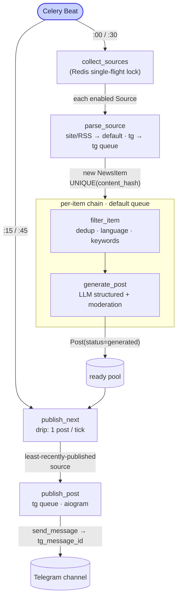

# M4 — AI Post Generator for Telegram

**English** · [Українська](README.uk.md)

A service that collects news from RSS/websites and public Telegram channels, filters and deduplicates them, generates a concise Ukrainian post with an LLM, and **drip-publishes** it to your own channel — all driven by a REST API with Swagger.


---

## Table of Contents

1. [What it does](#what-it-does)
2. [Architecture](#architecture)
3. [Quick start (Docker Compose)](#quick-start-docker-compose)
4. [Telegram session (one-time step)](#telegram-session-one-time-step)
5. [Local development (uv)](#local-development-uv)
6. [Environment variables](#environment-variables)
7. [API — request examples](#api--request-examples)
8. [Deviations from the assignment](#deviations-from-the-assignment)
9. [Feature checklist](#feature-checklist)
10. [Known limitations](#known-limitations)
11. [License](#license)

---

## What it does

- 📥 **News collection** from RSS/Atom, plain websites (scrape), and public Telegram channels (Telethon), every 30 minutes.
- 🧹 **Filtering** by language (lingua), keywords with lemmatization (pymorphy3), and deduplication (exact `content_hash` + Redis seen-set).
- 🤖 **AI generation** of a Ukrainian post via structured outputs (a typed response, not raw text); the source link and hashtags are added by code, not the model.
- 📤 **Drip publishing** through a bot (aiogram): one post per tick with source rotation, so the channel never bursts a batch or gets stuck on a single feed.
- 🛠 **REST API control** + Swagger (`/docs`): CRUD for sources and keywords, post history, error log, manual generation trigger.
- 🧱 **Resilience**: idempotent tasks, typed retries for Telegram errors, one failing step never crashes the whole batch.

---

## Architecture



### Processes (Docker Compose)

| Service | Role | Concurrency |
|---|---|---|
| **api** | FastAPI + Uvicorn: serves REST requests, enqueues tasks | — |
| **worker-default** | RSS/site parsing, filtering, LLM generation | 4 |
| **worker-tg** | Telethon (reading) + aiogram (publishing) | **1** (a single Telethon client — otherwise `AuthKeyDuplicated`) |
| **beat** | Celery Beat: `collect_sources` (:00/:30) + `publish_next` (:15/:45) | 1 |
| **redis** | Broker + result backend + dedup seen-set + Redis lock | — |
| **db** | PostgreSQL 16 | — |
| **flower** | Queue dashboard (`:5555`) — see [limitations](#known-limitations) | — |
| **migrate** | One-shot init: `alembic upgrade head` | — |

`depends_on: condition: service_healthy` enforces startup order: db/redis → migrate → api/workers/beat.

### Pipeline

Collection and publishing are **decoupled**. `collect_sources` fills a pool of ready posts; `publish_next` drips them out one at a time — giving a steady cadence and source variety.

```
beat :00/:30
  └─ collect_sources  (Redis lock SET NX EX — no overlapping cycles)
       └─ for each enabled Source → parse_source
            • site/RSS → default queue        • tg → tg queue (Telethon, min_id increment)
            parse: UPSERT NewsItem UNIQUE(content_hash); duplicate = no-op
       └─ for each NEW NewsItem:  chain( filter_item | generate_post )
            filter_item   — Redis seen-set dedup → language (lingua) → keyword (pymorphy3)
            generate_post — LLM structured + moderation → Post(status=generated)
            ⮑ NO publishing here: the post lands in the "ready pool"

beat :15/:45  (offset +15 min so freshly generated posts are ready)
  └─ publish_next  — picks 1 post from the least-recently-published source
       └─ publish_post (tg queue) — aiogram send → tg_message_id, status=published
```

Any step can cleanly stop the chain: filter miss → `filter_item` returns `None`, the next task is skipped; a generation/publish error → `Post.status=failed` + an `ErrorLog` row.

### Source rotation at publish time

`publish_next` picks a post from the source with the **oldest** last publish (never-published sources first), and within that source the newest post. This way the highest-volume feed cannot dominate the timeline, and the curated long tail gets airtime.

### Telegram split: Telethon reads, aiogram writes

- **Telethon** (user session, MTProto) — **reads** public channels. The Bot API physically cannot see other people's channels, so Telethon is indispensable.
- **aiogram** (Bot API) — **publishes** to your own channel, where the bot is an admin with `can_post_messages`.

Full rationale in [Deviations from the assignment](#why-aiogram-instead-of-telethon-only).

---

## Quick start (Docker Compose)

```bash
# 1. .env from the template
cp .env.example .env

# 2. Fill in secrets in .env (OPENAI_API_KEY, TELEGRAM_*) — see "Environment variables".
#    TELETHON_STRING_SESSION is generated in the next step.

# 3. Bring up the full stack (migrate runs alembic upgrade head automatically)
docker compose up --build
```

| URL | What opens |
|---|---|
| `http://localhost:8000/docs` | Swagger UI |
| `http://localhost:8000/health` | Health check |
| `http://localhost:5555` | Flower (queues) |

> [!IMPORTANT]
> `docker-compose.yml` sets `ENVIRONMENT=prod`, which enables fail-fast `pydantic-settings` validation: if any required secret is empty, the service won't start and tells you exactly which field is missing.

> [!TIP]
> If the host already uses ports `5432`/`6379`, there's an untracked override `docker-compose.smoke.yml` (db → `5433`, redis → `6380`):
> `docker compose -f docker-compose.yml -f docker-compose.smoke.yml up --build`.

---

## Telegram session (one-time step)

Telethon needs a user session (`StringSession`) to read public channels:

```bash
# Locally:
uv run python -m scripts.login
# Or via a throwaway container:
docker compose run --rm api python -m scripts.login
```

The script asks for your phone number, the confirmation code (and the 2FA password if enabled) and prints a `StringSession`. Paste it into `.env`:

```dotenv
TELETHON_STRING_SESSION=1BVtsOI8Bu...
```

> [!NOTE]
> **Bot admin:** the bot from `TELEGRAM_BOT_TOKEN` must be added as an administrator of channel `TELEGRAM_CHANNEL_ID` with the `can_post_messages` right.
> **Security:** for production, prefer a separate "throwaway" reader account. The bot publishes via aiogram, so the user session stays passive read-only. The `StringSession` never goes into git.

---

## Local development (uv)

```bash
uv sync                                   # install dependencies

uv run pytest -q                          # tests (network-clean: fakeredis, respx, mocks) — 225 passing
uv run ruff check                         # linter
uv run ruff format                        # formatter
uv run alembic upgrade head               # migrations (SQLite by default)

# Run components individually:
uv run uvicorn app.main:app --host 0.0.0.0 --port 8000
uv run celery -A app.tasks.celery_app worker -Q default -c 4 -l info
uv run celery -A app.tasks.celery_app worker -Q tg -c 1 -l info
uv run celery -A app.tasks.celery_app beat -l info
uv run celery -A app.tasks.celery_app flower --port=5555
```

For local runs without Docker, Redis is enough (`redis-server`); the DB is SQLite (`DATABASE_URL=sqlite:///./app.db`, the default).

---

## Environment variables

All variables are read from `.env` via `pydantic-settings`. **Required in `prod`** are marked 🔑.

| Variable | Purpose | Example / default |
|---|---|---|
| `ENVIRONMENT` | `local` (SQLite, no secret checks) or `prod` (Postgres, fail-fast) | `local` |
| `DATABASE_URL` | SQLAlchemy DB URL | `sqlite:///./app.db` |
| `REDIS_URL` | Redis: broker + backend + seen-set + lock | `redis://localhost:6379/0` |
| 🔑 `OPENAI_API_KEY` | OpenAI or OpenRouter key (SecretStr) | `sk-...` / `sk-or-...` |
| `OPENAI_MODEL` | Generation model (for OpenRouter — a model id with structured outputs) | `gpt-4o-mini` |
| `OPENAI_TIMEOUT` | Request timeout, seconds | `30` |
| `OPENAI_BASE_URL` | OpenAI-compatible endpoint; empty = OpenAI. OpenRouter: `https://openrouter.ai/api/v1` | _(empty)_ |
| `MODERATION_ENABLED` | Moderation gate; `false` for OpenRouter (no `/moderations`) | `true` |
| 🔑 `TELEGRAM_API_ID` | Telethon `api_id` from my.telegram.org (int) | `12345678` |
| 🔑 `TELEGRAM_API_HASH` | Telethon `api_hash` (SecretStr) | `abc123...` |
| 🔑 `TELETHON_STRING_SESSION` | Reader session (SecretStr), via `scripts/login.py` | `1BVtsOI8...` |
| 🔑 `TELEGRAM_BOT_TOKEN` | Bot API token from @BotFather (SecretStr) | `123456:ABC...` |
| 🔑 `TELEGRAM_CHANNEL_ID` | Publish target channel id (int, negative) | `-1001234567890` |
| `ALLOWED_LANGUAGES` | Allowed source languages (output is always Ukrainian) | `["uk","en"]` |
| `DEDUP_TTL_SECONDS` | Redis seen-set TTL | `604800` (7 days) |
| `KEYWORD_MATCH_MODE` | Keyword filter semantics: `any` (OR) / `all` (AND) | `any` |
| `POST_MAX_LEN` | Hard post length limit (characters) | `4096` |
| `MAX_ITEMS_PER_PARSE` | Max items per source per parse (newest) — bounds backfill | `25` |

---

## API — request examples

Base: `http://localhost:8000`. All list endpoints return the envelope `{"data": [...], "count": N}`; pagination via `?limit=` (1–100, default 20) and `?offset=`.

```bash
curl http://localhost:8000/health
# {"status":"ok"}
```

<details>
<summary><b>Sources</b> — source CRUD (<code>/api/v1/sources</code>)</summary>

```bash
# List
curl "http://localhost:8000/api/v1/sources?limit=10&offset=0"

# Create an RSS/site source (type=site)
curl -X POST http://localhost:8000/api/v1/sources \
  -H "Content-Type: application/json" \
  -d '{"type":"site","name":"DOU","url":"https://dou.ua/rss/all.xml","enabled":true}'
# 201; 409 if the url already exists

# Create a Telegram channel source (type=tg)
curl -X POST http://localhost:8000/api/v1/sources \
  -H "Content-Type: application/json" \
  -d '{"type":"tg","name":"TechUA","url":"@techUA","enabled":true}'

# Get one / partial update / delete
curl http://localhost:8000/api/v1/sources/{id}                 # 200 | 404
curl -X PATCH http://localhost:8000/api/v1/sources/{id} \
  -H "Content-Type: application/json" -d '{"enabled":false}'   # 200
curl -X DELETE http://localhost:8000/api/v1/sources/{id}       # 204
```

> `type` is `site` or `tg`. For `site`, the parser kind (RSS vs scrape) is decided by the URL (`rss`/`feed`/`atom`/`.xml` → RSS, otherwise scrape).
</details>

<details>
<summary><b>Keywords</b> — keyword CRUD (<code>/api/v1/keywords</code>)</summary>

```bash
curl "http://localhost:8000/api/v1/keywords?limit=20&offset=0"

curl -X POST http://localhost:8000/api/v1/keywords \
  -H "Content-Type: application/json" \
  -d '{"word":"штучний інтелект","lang":"uk"}'      # 201; 409 if it exists

curl -X PATCH http://localhost:8000/api/v1/keywords/{id} \
  -H "Content-Type: application/json" -d '{"lang":"en"}'   # 200
curl -X DELETE http://localhost:8000/api/v1/keywords/{id}  # 204
```
</details>

<details>
<summary><b>Posts</b> — post history (<code>GET /api/v1/posts</code>)</summary>

```bash
curl "http://localhost:8000/api/v1/posts?limit=10&offset=0"        # all, newest first
curl "http://localhost:8000/api/v1/posts?status=failed"            # filter by status
# status ∈ new | generated | published | failed
# item: {id, news_id, generated_text, status, published_at, tg_message_id, error, created_at}
```
</details>

<details>
<summary><b>Generate</b> — manual generation trigger (<code>POST /api/v1/generate</code>)</summary>

```bash
# By existing NewsItem:
curl -X POST http://localhost:8000/api/v1/generate \
  -H "Content-Type: application/json" \
  -d '{"news_id":"550e8400-e29b-41d4-a716-446655440000"}'
# 202 {"task_id":"...","post_id":null}

# Ad-hoc text (no NewsItem):
curl -X POST http://localhost:8000/api/v1/generate \
  -H "Content-Type: application/json" \
  -d '{"text":"Arbitrary text to generate a post from"}'
# 202 {"task_id":"...","post_id":null}
```

> The endpoint **enqueues a task** (202 Accepted) and does not wait. For ad-hoc text it creates a synthetic `NewsItem` (`source="manual"`), then runs **generation only** (no auto-publish). The result appears in `GET /api/v1/posts`. At least one of `news_id` / `text` is required (otherwise 422).
</details>

<details>
<summary><b>Errors</b> — error log (<code>GET /api/v1/errors</code>)</summary>

```bash
curl "http://localhost:8000/api/v1/errors?limit=10&offset=0"
curl "http://localhost:8000/api/v1/errors?stage=publish"   # stage ∈ parse | generate | publish
# item: {id, created_at, stage, source_id, news_id, post_id, message}
```
</details>

---

## Deviations from the assignment

The implementation deliberately departs from several prescriptions of the course assignment ([`docs/Project M4-1.md`](docs/Project%20M4-1.md)). Each deviation with its technical rationale:

| Assignment (M4-1) | Implementation | Why |
|---|---|---|
| Publish **via Telethon** (§5) | **aiogram** (Bot API) for publishing; Telethon for reading only | ban-safety + the right tool for posting to your own channel ([details](#why-aiogram-instead-of-telethon-only)) |
| AI generation with **`asyncio`** (checklist #4) | **Fully synchronous** stack; `asyncio` only in isolated islands | Celery prefork = processes with no event loop ([details](#why-a-synchronous-stack)) |
| **OpenAI GPT-4** via public API (§3) | Any **OpenAI-compatible** provider (`OPENAI_MODEL`/`OPENAI_BASE_URL`) + **structured outputs**; default `gpt-4o-mini`, tested on OpenRouter | provider/cost flexibility; a typed response is more reliable than GPT-4 free text |
| Simple "emoji + CTA" prompt (§3) | A detailed Ukrainian prompt (persona, hook, varied CTA, forbidden phrases); **link and hashtags added by code**, not the model | more stable quality; the URL is formatted by code → the model can't hallucinate links |
| Broker **RabbitMQ or Redis** (§2) | **Redis** (broker + backend + dedup + lock) | one datastore instead of two; `SET NX EX` gives atomic dedup and lock "for free" |
| Dedup by **title/url/content** (§4) | exact `content_hash` (sha256 of normalized title+url) + Redis seen-set; near-dup/SimHash is future work | reliable exact dedup now; semantic near-dup needs threshold tuning on real data |
| **Flat** structure (`app/tasks.py`, `app/models.py`, `app/api/endpoints.py`) | **Layered package** structure (`app/api/v1/routers`, `app/news_parser`, `app/ai`, `app/filter`, `app/tasks/`, `app/models/`) | scalability, testability, separation of concerns |
| `requirements.txt` | **uv** + `pyproject.toml` + `uv.lock` | reproducible builds, fast resolver, lock file |
| Post model: `published_at`, `status` | + `tg_message_id`, `error`, `created_at`, `news_id` FK | publish + error traceability |
| (beyond the assignment) | **Drip publishing** with source rotation instead of publishing right after generation | steady cadence (~1 post / 30 min), no batch burst, no single-source monotony |

### Why a synchronous stack

The assignment mentions `asyncio` for generation; we chose **sync-everywhere**. This is a deliberate decision driven by Celery's execution model.

- **Celery prefork = processes with no event loop.** Each worker is a separate OS process. An async ORM (`AsyncSession`/`asyncpg`) needs a live event loop for the entire lifetime of the session and connection pool. Under prefork that means either `asyncio.run()` per task (a new loop and a new connection every time — the pool is wasted), or manual loop management with familiar footguns (`event loop is closed`, pool races on `fork`). Sync removes this entire class of problems.
- **Heavy work lives in tasks, not in HTTP.** Parsing, generation, and publishing run in Celery; the API is a thin "CRUD + enqueue" layer. Async in the routers would buy almost nothing, since the long I/O operations are already in the queue.
- **One data layer for both.** The same `SessionLocal` (sync) serves both FastAPI (sync `def` → threadpool) and Celery. No need to maintain two parallel implementations (sync + async engine/sessions/test fixtures).
- **Sync `def` routes are FastAPI's intended path** for blocking code: they run in a threadpool and don't block the server's event loop.
- **Parallelism comes from processes.** Workers and queues provide it (`worker-default -c 4`, separate `default`/`tg`), not `asyncio`. For a "N sources every 30 min" workload, that's more than enough.
- **Async stays exactly where the libraries are async-only** (Telethon, aiogram): a thin `asyncio.run(coro)` facade returns plain data/ids, and the rest of the code never sees a coroutine. A fresh client per call keeps state from leaking across tasks.

📎 `app/core/db.py` (sync `create_engine`/`sessionmaker`), `app/telegram/publisher.py:23-24`, `app/news_parser/telegram_reader.py:88-89` (`asyncio.run` islands).

### Why aiogram instead of Telethon-only

The assignment §5 literally requires "publish **via Telethon**". We deliberately publish via **aiogram (Bot API)** and keep Telethon for reading only — because these are two different protocols for two different jobs.

- **Telethon = a user account's MTProto client.** It reads public channels the bot isn't a member of — something the Bot API simply **can't** do. For aggregation, Telethon is indispensable.
- **aiogram = a Bot API client.** It posts to your own channel, where the bot is an admin.
- **Why not publish from the user account (as the assignment asks):**
  1. **Ban risk.** Auto-posting as a user is the single riskiest action for an account (spam reports → ban). A bot admin posts normally and safely; the user session stays a passive read-only reader, so account risk is minimal.
  2. **The right tool.** Posting to your own channel is the canonical Bot API use case: official, stable, no sessions/2FA for the posting itself.
  3. **A clean contract.** `send_message` returns a `message_id` (stored in `Post.tg_message_id` for idempotency and tracing), and typed errors (`TelegramRetryAfter`/`ServerError`/`Forbidden`/`BadRequest`) enable a precise retry policy: transient → `retry` with cooldown, permanent → `failed` without retry.
  4. **HTML parse_mode + link preview** out of the box.

📎 `app/news_parser/telegram_reader.py` (read, Telethon), `app/telegram/publisher.py` (write, aiogram), `app/tasks/pipeline.py` → `publish_post` (typed retries).

---

## Feature checklist

All assignment M4-1 §5 items are implemented; verified by tests (225, network-clean).

| # | Assignment feature | ✓ | Where (module / test) |
|---|---|---|---|
| 1 | News collection (sites/RSS) — Celery Beat | ✅ | `app/news_parser/feed.py`, `site.py`; `tests/parser/` |
| 2 | News collection (Telegram) — Telethon | ✅ | `app/news_parser/telegram_reader.py`; `tests/parser/test_telegram_reader.py` |
| 3 | Filtering (keyword/language/dedup) | ✅ | `app/filter/`; `tests/filter/` |
| 4 | AI post generation | ✅ | `app/ai/`, `app/tasks/pipeline.py`; `tests/ai/` |
| 5 | Publishing to Telegram | ✅ | `app/telegram/publisher.py`, `publish_post`; `tests/tasks/`, `tests/telegram/` |
| 6 | API source management (CRUD) | ✅ | `app/api/v1/routers/sources.py`; `tests/api/test_sources.py` |
| 7 | API filters / keywords (CRUD) | ✅ | `app/api/v1/routers/keywords.py`; `tests/api/test_keywords.py` |
| 8 | Post history (`GET /posts`) | ✅ | `app/api/v1/routers/posts.py`; `tests/api/test_posts.py` |
| 9 | Manual generation (`POST /generate`) | ✅ | `app/api/v1/routers/generate.py`; `tests/api/test_generate.py` |
| 10 | API docs (Swagger `/docs`) | ✅ | FastAPI auto |
| 11 | Logging | ✅ | `app/core/logging.py` (structlog), `ErrorLog` + `GET /errors` |

---

## Known limitations

- **No API authentication.** The admin API (`/sources`, `/keywords`, `/generate`) is open — auth and rate-limiting are deliberately out of scope for the capstone (see the design-spec anti-patterns list). For production, put it behind a reverse proxy with auth (Bearer / API key) or add `slowapi` rate-limiting. SSRF is already mitigated: source URLs resolving to private/loopback/link-local addresses are rejected both at API validation and at fetch time.
- **Flower + Celery 5.6.** Flower `2.0.1` has an upstream incompatibility with Celery 5.6: the service connects to the broker, but the web UI on `:5555` hangs. The pipeline is **unaffected** — monitor via logs: `docker compose logs -f worker-default worker-tg beat`. If you need the dashboard, temporarily pin `celery>=5.4,<5.5` or install Flower from git.
- **Telethon archived (Feb 2026).** Version `1.43.x` is pinned; the code works. If needed, switch to a Codeberg mirror/fork. Don't use `2.0 alpha` (unstable).
- **Near-dup / SimHash — future work.** **Exact** dedup is implemented (`content_hash` + Redis seen-set). Semantic near-dup needs threshold tuning on real data (risk of false drops).
- **Telegram ToS §1.5.** This clause forbids aggregating platform data to train AI without permission — the "AI posts from scraped public channels" pipeline is formally in a **gray area** (the restriction applies to READ regardless of how you publish). Tolerated for an educational capstone; production use needs a legal review.
- **Residual user-account ban risk.** Read-only Telethon lowers the risk but not to zero. Mitigations: a separate "throwaway" account, `resolve-once + cache` of the entity, incremental reads (`min_id`), a single client (`worker-tg -c 1`), `StringSession` out of git.

---

## License

[MIT](LICENSE) © 2026 Maxim Rabchun
